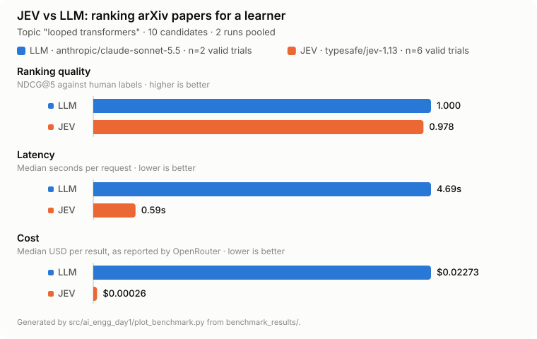

# JEV vs LLM: ranking research papers

Can a purpose-built scoring model rank arXiv papers as well as a general LLM,
for a fraction of the cost and latency? This repo runs both against the same
rubric, scores their top-5 picks against human labels, and charts the result.
You can rerun it on your own topic in a few minutes.

<picture>
  <source media="(prefers-color-scheme: dark)" srcset="docs/benchmark-dark.svg">
  
</picture>

## Results so far

Topic: *looped transformers*, 10 arXiv candidates, graded 0–4 by a human.

| | LLM (`anthropic/claude-sonnet-5.5`) | JEV (`typesafe/jev-1.13`) |
|---|---|---|
| Valid trials | 2 | 6 |
| Ranking quality (mean NDCG@5) | **1.000** | 0.978 |
| Median latency | 4.69 s | **0.59 s** |
| Cost per result | $0.0227 | **$0.00026** (~88× cheaper) |

Both rankers put the human's top paper first and agree on 4 of their 5 picks.
JEV's only miss was placing the grade-3 paper third instead of second.

**Read these numbers with care:**

- **Small sample.** The LLM has only 2 successful trials. Its other attempts
  failed because the OpenRouter account ran out of credit, not because of the
  model.
- **Coarse labels.** 7 of the 10 papers share the same grade (2), so any top 5
  that includes the grade-4 and grade-3 papers scores close to 1.0. This test
  mainly checks whether a ranker finds those two papers.
- **One topic.** Results on other topics may differ. Please share yours.

## How the comparison works

Both rankers get identical input: the topic and each paper's title and
abstract. They score every paper on two rubrics, each from 0 to 4:

- **Relevance:** how directly the paper addresses the topic.
- **Learning value:** how useful it is as early reading for someone who knows
  standard Transformers but is new to the topic.

Rubrics and candidate text are defined once in
[benchmark_rankers.py](src/ai_engg_day1/benchmark_rankers.py) and sent to:

| Ranker | OpenRouter endpoint | How scores come back |
|---|---|---|
| JEV | `/api/alpha/decisions` | One typed `score` answer per question |
| LLM | `/api/v1/chat/completions` | Strict JSON-schema structured output |

Every response is validated: all scores must be present, numeric and within
0–4, or the trial counts as invalid. The same rule then picks each ranker's
top 5 from its scores: drop papers with relevance below 2.5, then rank by
`0.4 × relevance + 0.6 × learning`. That top 5 is scored with **NDCG@5**
against the human grades in
[ranking_labels.json](src/ai_engg_day1/ranking_labels.json). 1.0 means the
best possible order.

Each trial alternates which ranker goes first. Every run is saved to
`benchmark_results/run_<timestamp>/`, with the exact config, every request's
result (latency, cost, tokens, errors) and a summary.

## Run it yourself

You need [uv](https://docs.astral.sh/uv/) and an
[OpenRouter API key](https://openrouter.ai/keys) with a little credit. One run
of 5 trials costs about $0.12, almost all of it LLM calls.

```bash
git clone https://github.com/sabmaverick1305/jev-vs-llm-paper-ranking.git
cd jev-vs-llm-paper-ranking
uv sync
cp .env.example .env    # then add your OPENROUTER_API_KEY
```

Run the benchmark, then redraw the charts:

```bash
uv run python src/ai_engg_day1/benchmark_rankers.py
uv run python src/ai_engg_day1/plot_benchmark.py
```

The charts pool every saved run that used the same candidates, rubrics and
labels as your newest run, so repeated runs add to the sample. Change
`TRIALS` in `benchmark_rankers.py` to run more trials per pair. To compare a
different LLM, set `BENCH_LLM_MODEL` in `.env` to any OpenRouter model that
supports structured outputs.

### Try your own topic

1. Fetch candidates from arXiv (up to 10 works well):

   ```bash
   uv run python -c "import json; from ai_engg_day1.main import search_arxiv; \
   print(json.dumps(search_arxiv('your topic', 10), indent=2))" \
   > src/ai_engg_day1/looped_transformer_candidates.json
   ```

2. Set `TOPIC` in `benchmark_rankers.py`. If your topic isn't a Transformer
   variant, also edit the reader description in the `learning` rubric.
3. Grade every paper in `src/ai_engg_day1/ranking_labels.json` with a whole
   number from 0 (not useful) to 4 (best starting point), keyed by `paper_id`.
   Do this yourself, before looking at either ranker's output. Using the full
   range makes the comparison more informative.
4. Run the benchmark and plot as above.

## Also in this repo: a research API

The benchmark grew out of a small FastAPI service that searches arXiv and
summarizes abstracts with Claude.

| Endpoint | What it does |
|---|---|
| `POST /research` | Searches arXiv and returns up to 5 papers, optionally with structured, abstract-only summaries |
| `POST /research/agent` | Lets Claude decide when to search (up to 3 searches), then answers with cited paper IDs |
| `GET /health` | Liveness check |

It needs `ANTHROPIC_API_KEY` and `ANTHROPIC_MODEL` in `.env`:

```bash
uv run uvicorn ai_engg_day1.main:app --reload --port 8000
curl -sS localhost:8000/research -H 'Content-Type: application/json' \
  -d '{"topic":"speculative decoding","max_results":5,"summarize":true}'
```

Interactive docs are at http://localhost:8000/docs.
[jev_rank.py](src/ai_engg_day1/jev_rank.py) is a standalone example that
ranks live arXiv results with JEV alone.

Limits: summaries use abstracts only, never full papers. JSON validation checks
structure and paper IDs, not whether a claim is true. arXiv requests are paced
within a single process, so run one uvicorn worker.

## Project layout

```
src/ai_engg_day1/
  benchmark_rankers.py               JEV vs LLM benchmark
  plot_benchmark.py                  Light/dark SVG charts → docs/
  looped_transformer_candidates.json Candidate papers
  ranking_labels.json                Human grades (0–4)
  benchmark_results/                 One folder per run
  main.py, agent.py, core.py         Research API
  jev_rank.py                        Standalone JEV ranking example
docs/                                Generated charts
```

## References

- [arXiv API user manual](https://info.arxiv.org/help/api/user-manual.html)
- [OpenRouter structured outputs](https://openrouter.ai/docs/features/structured-outputs)
- [Anthropic Python SDK](https://platform.claude.com/docs/en/cli-sdks-libraries/sdks/python)
